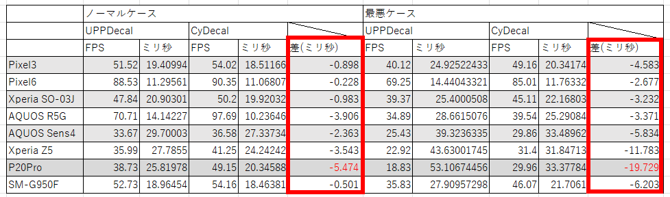
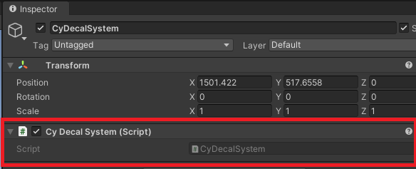
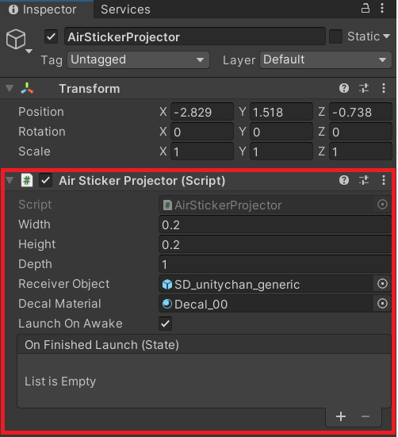

<p align="center">


</p>

# Air Sticker
[](LICENSE.md)
[](hogehoge)
[](#Requirements)

**Documents** ([English](README.md), [日本語](README_JA.md)) <br/>
**Technical Documents** ([English](README_DEVELOPERS.md), [日本語](README_DEVELOPERS_JA.md)) <br/>

## Section 1 Summary
Air Sticker is a decal system that addresses the limitations of URP decals and has a low impact on performance.<br/>
Also, URP decals can only be used with Unity2021 or higher, while Air Sticker supports operation with Unity2020 or higher.<br/>

<br/>
<p align="center">
<br>
</p>

<br/>
<p align="center">
<br>
</p>

## Section 2 Feature
Air Sticker implements decal processing using the typical mesh generation method used in many games.<br/>

Mesh-generated decals implement decal expression by generating a mesh at runtime with a shape that matches the model to which the decal will be applied and then applying a texture to it.<br/>

On the other hand, the decal process implemented in Unity implements projected DBuffer decals and screen space decals.<br/>

Both mesh generation and projection decals have advantages/disadvantages.<br/>
The mesh generation and projection methods can also be used together to compensate for many disadvantages. (see section 2.1 and 2.2 for details).<br/>

### 2.1 Advantages and Disadvantages of URP Decal and Air Sticker
The advantages/disadvantages of URP decals and Air Sticker are as follows.

- **URP Decal**
  - **Advantages**
    - Fast-applied decal.
    - Z-fighting doesn't happen.
  - **Demerit**
    - Difficult to support full skin animation. ( Can be complemented with Air Sticker. )
    - Pixel shaders are overloaded.( Can be complemented with Air Sticker. )
    -  Custom shaders cannot be used as is.( Can be complemented with Air Sticker. )
- **Air Sticker**
  -  **Advantages**
     - Lightweight processing.( However, decal mesh generation is laggy )
     - Full skin animation is possible.
     - Custom shaders can be used without modification.
  - **Demerit**
    - The process of applying decals takes time. ( Can be complemented with URP decals. )
    - Z-fighting happen.

Thus, the two decals can be used together to complement many of the disadvantages.<br/>

### 2.2 Combination of URP decal and Air Sticker
As we saw in the previous section, the two decal treatments can be used together to complement many disadvantages.<br/><br/>

The following model case is presented here as a way of combining the two.

|Method|Use Case|
|---|---|
|URP Decal| ・ Decal moves in the object space.<br/> ・ An alternative method until the mesh generation by Air Sticker is finished.|
|Air Sticker|Decal don't moves in object space.|

The following movie demonstrates the implementation of this model case.

<br/>
<p align="center">
<br>
<font color="grey">Combination of URP decal and Air Sticker</font>
</p>

In this movie, URP decal is used when the decal moves on the receiver object and to buy time until mesh generation is complete.<br/>
Once the position on the receiver object is determined and mesh generation is finished, the decal by Air Sticker is displayed thereafter.<br/>

Once mesh generation is complete, Air Sticker can be used to greatly improve runtime performance(see Section 2.3 for details).<br/>

### 2.3 URP Decal and Air Sticker rendering performance
Air Sticker takes several frames to generate the mesh, but once generated, the drawing performance is no different than simple mesh drawing.<br/>
On the other hand, URP decals do not require mesh generation, but a complex drawing process is performed to display the decals.<br/><br/>
Therefore, the mesh generation method is more advantageous in terms of frame-by-frame rendering performance.<br/><br/>

The following figure shows the measured rendering performance of URP Decal and Air Sticker.<br/>
In all cases, Air Sticker was superior, with the most significant difference being a performance improvement of 19 ms.
<p align="center">
<br>
<font color="grey">Performance Measurement Results</font>
</p>

## Section 3 Install
To install the software, follow the steps below.

1. Open the Package Manager from `Window > Package Manager`
2. `"+" button > Add package from git URL`
3. Enter the following
   * https://github.com/CyberAgentGameEntertainment/AirSticker.git?path=/Assets/AirSticker

<p align="center">
  
</p>

Or, open `Packages/manifest.json` and add the following to the dependencies block.

```json
{
    "dependencies": {
        "jp.co.cyberagent.air-sticker": "https://github.com/CyberAgentGameEntertainment/AirSticker.git?path=/Assets/AirSticker"
    }
}
```

If you want to set the target version, write as follows.

* https://github.com/CyberAgentGameEntertainment/AirSticker.git?path=/Assets/AirSticker#1.0.0

Note that if you get a message like `No 'git' executable was found. Please install Git on your system and restart Unity`, you will need to set up Git on your machine.

To update the version, rewrite the version as described above.  
If you don't want to specify a version, you can also update the version by editing the hash of this library in the package-lock.json file.

```json
{
  "dependencies": {
      "jp.co.cyberagent.air-sticker": {
      "version": "https://github.com/CyberAgentGameEntertainment/AirSticker.git?path=/Assets/AirSticker",
      "depth": 0,
      "source": "git",
      "dependencies": {},
      "hash": "..."
    }
  }
}
```

## Section 4 How to use
The following two classes are important for using Air Sticker.
1. AirStickerSystem
2. AirStickerProjector 

### 4.1 AirStickerSystem
To use Air Sticker, you must have one game object attached to this component in your scene.

<p align="center">
<br>
<font color="grey">AirStickerSystem</font>
</p>

### 4.2 AirStickerProjector
This component is used to project decals. Add this component to the game object that you want to use as a decal projector.

<p align="center">
<br>
<font color="grey">AirStickerProjector inspector</font>
</p>

Five parameters can be set for the AirStickerProjector component.

|Parameter name|Description|
|---|---|
|Width|Width of the Projector bounding box.This complies with URP's decal projector specifications.<br/>For more information, see [Manual for URP Decals](https://docs.unity3d.com/Packages/com.unity.render-pipelines.universal@14.0/manual/renderer-feature-decal.html).|
|Height|Height of the Projector bounding box.This complies with URP's decal projector specifications.<br/>For more information, see [Manual for URP Decals](https://docs.unity3d.com/Packages/com.unity.render-pipelines.universal@14.0/manual/renderer-feature-decal.html).|
|Depth|Depth of the Projector bounding box.This complies with URP's decal projector specifications.<br/>For more information, see [Manual for URP Decals](https://docs.unity3d.com/Packages/com.unity.render-pipelines.universal@14.0/manual/renderer-feature-decal.html).|
|Receiver Objects| The objects to which the decal texture will be applied.<br/>AirStickerProjector targets all renderers pasted to children of the configured receiver object (including itself).<br/><br/>Therefore, the receiver object can be specified directly as an object to which a component such as MeshRenderer or SkinMeshRenderer is attached, or it can be an object that contains an object to which a renderer is attached as a child.<br/>The more renderers you process, the longer it will take to generate the decal mesh.Therefore, if the object to which the decal texture is to be applied can be restricted, it is more advantageous to specify that object directly as the receiver object.<br/><br/>For example, if you want to put a sticker on a character's face in a character edit, you can save mesh generation time by specifying the object to which the face renderer is attached rather than specifying the character's root object.|
|Decal Material| URP decals can only use materials with Shader Graphs/Decal shaders assigned, while Air Sticker can use regular materials.<br/>This means that built-in Lit shaders, Unlit shaders, and user-custom, proprietary shaders are also available.|
|Z Offset In Decal Space|This is the Z offset in the surface space where the decal is applied. By adjusting this value, you can reduce Z-fighting.|
|Projection Backside|If this checkbox is checked, the decal mesh is projected onto the mesh on the backside.|
|Launch On Awake|If this checkbox is checked, the decal projection process is started at the same time the instance is created.|
|On Finished Launch|You can specify a callback to be called at the end of the decal projection.|

The following video shows how to use AirStickerProjector in a scene.
<p align="center">
<br>
<font color="grey">How to use AirStickerProjector</font>
</p>


### 4.3 How to generate AirStickerProjector in-game
An example of an in-game use of decals is the process of applying bullet holes to a background, such as in a FPS. <br/>
Such a process can be accomplished by determining the collision between the background and the bullet, generating a AirStickerProjector component based on the collision point information, and constructing a decal mesh.<br/><br/>
AirStickerProjector components can be created by calling the AirStickerProjector.CreateAndLaunch() method.</br>
If true is specified for the launchAwake argument of the CreateAndLaunch() method, the decal mesh construction process is started at the same time the component is created.<br/><br/>
The decal mesh construction process takes several frames.Therefore, if you want to monitor the end of the decal mesh construction process, you must monitor the NowState property of AirStickerProjector or use the onFinishedLaunch callback, which is called when the mesh generation process is finished.<br/><br/>
The following code is a pseudo code to paste bullet holes on the background using the AirStickerProjector.CreateAndLaunch() method. This code sets up a callback that monitors for termination using the arguments of the CreateAndLaunch() method.<br/>
```C#
// hitPosition    Bullet and background collision point.
// hitNormal      Normal of the collided surface.
// receiverObject Receiver object to which decal is applied.
// decalMaterial  Material with decal texture set
void LaunchProjector( 
  Vector3 hitPosition, Vector3 hitNormal, 
  GameObject receiverObject, Material decalMaterial )
{
    var projectorObject = new GameObject("Decal Projector");
    // Install the projector at the position pushed back in the normal direction.
    projectorObject.transform.position = hitPosition + hitNormal;
    // Projector is oriented in the opposite direction of the normal.
    projectorObject.transform.rotation = Quaternion.LookRotation( hitNormal * -1.0f );

    AirStickerProjector.CreateAndLaunch(
                    projectorObj,
                    receiverObject,
                    decalMaterial,
                    /*width=*/0.05f,
                    /*height=*/0.05f,
                    /*depth=*/0.2f
                    /*launchOnAwake*/true,
                    /*onCompletedLaunch*/() => { Destroy(projectorObj); });
}
```
***
<p align="right">
© Unity Technologies Japan/UC
</p>


