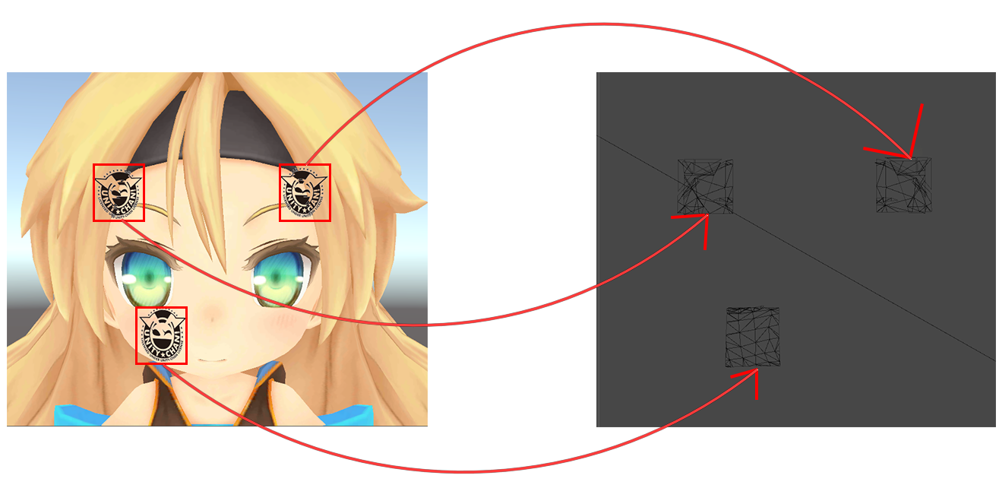
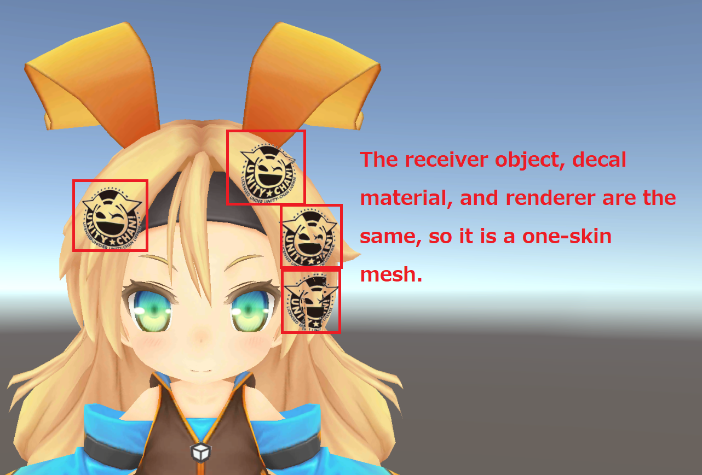
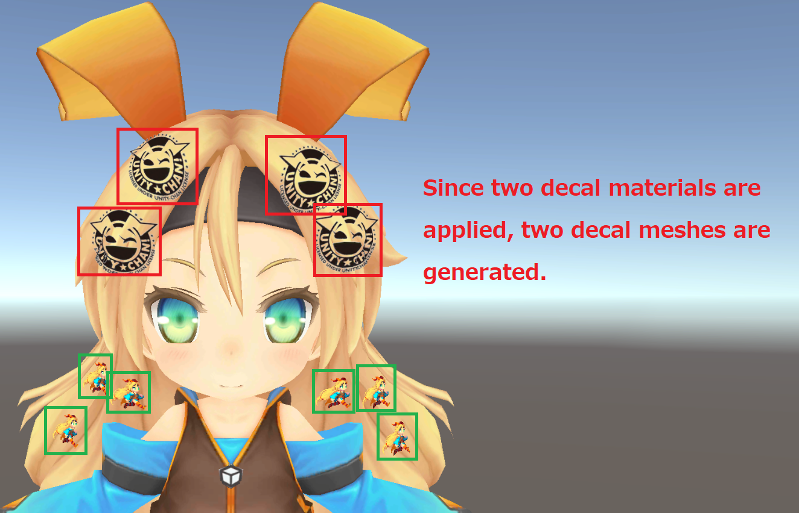
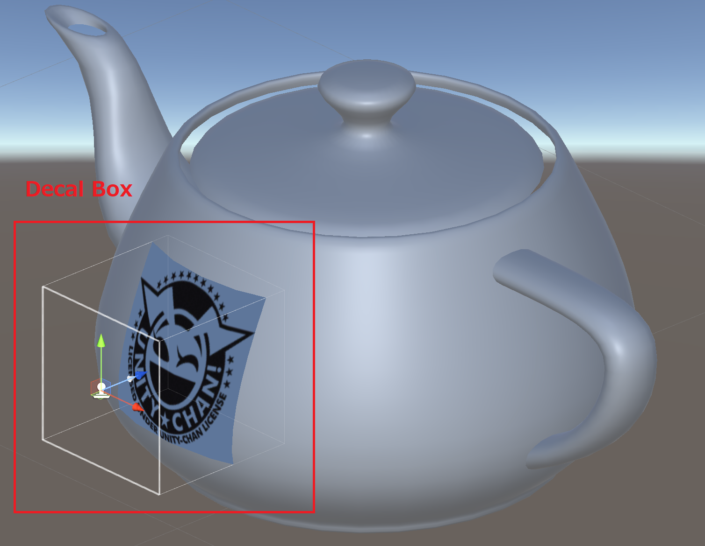
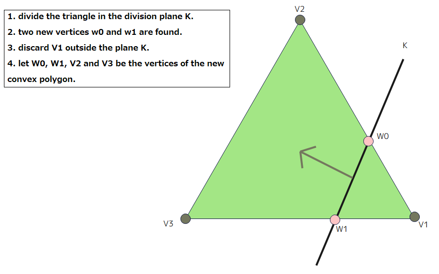
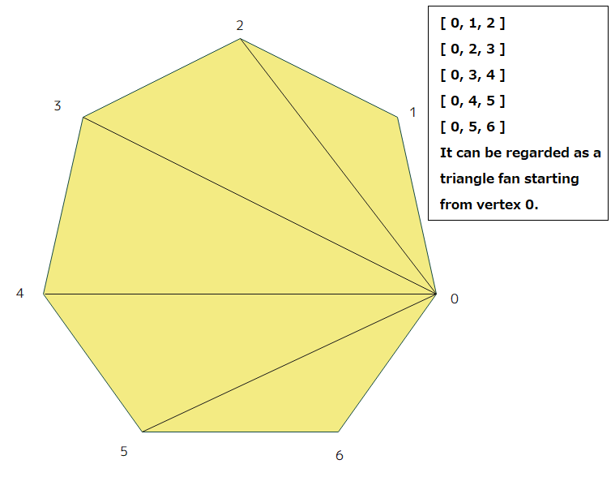

# CyDecal Technical Documentation

## Section 1 Summary
This document is intended for engineers and describes in detail the algorithms used inside CyDecal.<br/>


## Section 2 Algorithm Overview
CyDecal dynamically generates a decal mesh to which the decal texture is applied to create a decal representation.<br/>
When a sticker is applied to a character as a decal, as shown in the following figure, a decal mesh is dynamically generated so that the sticker will nicely adhere to the model.<br/>

<p align="center">
<br>
<font color="grey">Generated decal mesh</font>
</p>


The steps of the algorithm for creating a decal mesh are as follows
1. Get decal mesh to be edited from decal mesh pool.
2. Get the triangle polygons in model space of the receiver object to which the decal will be applied.
3. Early branch cut (broad phase) of triangular polygons to which decal textures are applied.
4. Defines the division plane from the information in the decal box.
5. Triangular polygons colliding in the division plane defined in 4 are divided into polygonal polygons.
6. Decal mesh is generated based on the polygonal polygon information created in 5.

Also, since polygon division in 4-6 is based on "9.2 Decal Application" in "Mathematics for 3D Game Programming &and Computer Graphics, 3rd Edition" only the outline of the algorithm and the related source code are described. For details of polygon division, please refer to the references.

## Section 3 Algorithm Details
Section 3 will go into more detail on the various steps.
### 3.1 Get the decal mesh to be edited from the decal mesh pool
Get the decal mesh to be edited from the decal mesh pool held by CyDecalSystem.<br/>
The decal mesh is registered in the pool using the hash values of the receiver object, renderer, and material as keys, and if these values are identical, they are used interchangeably. If this hash value is not registered in the pool, a new decal mesh is created.
<br/>
Therefore, the following decals are treated as a single decal mesh.

<p align="center">
<br>
<font color="grey">Single Decal Mesh</font>
</p>
In the following case, the receiver object and renderer are the same, but the decal material is different, so they are treated as two decal meshes.<br/>

<p align="center">
<br>
<font color="grey">Two Decal Mesh</font>
</p>


Number of decal meshes = number of draw calls. Therefore, one guideline for optimization is to reduce the number of decal mesh types.

[**Code that retrieves the decal mesh from the pool**]
```C#
// We want to collect only the renderer of receiver objects,
// But the renderer of decal mesh hanging from receiver object.
// Therefore, temporarily disable to the renderer of decal mesh.
Instance._decalMeshPool.DisableDecalMeshRenderers();
var renderers = receiverObject.GetComponentsInChildren<Renderer>();
foreach (var renderer in renderers)
{
    if (!renderer) return;
    var pool = Instance._decalMeshPool;
    var hash = CyDecalMeshPool.CalculateHash(receiverObject, renderer, decalMaterial);
    if (pool.Contains(hash))
    {
        results.Add(pool.GetDecalMesh(hash));
    }
    else
    {
        var newMesh = new CyDecalMesh(receiverObject, decalMaterial, renderer);
        results.Add(newMesh);
        pool.RegisterDecalMesh(hash, newMesh);
    }
}

// Restore the renderer of decal mesh was disabled.
Instance._decalMeshPool.EnableDecalMeshRenderers();
```

**Related Source Code**<br/>
[Assets/CyDecal/Runtime/Scripts/Core/CyDecalMeshPool.cs](Assets/CyDecal/Runtime/Scripts/CyDecalSystem.cs)<br/>
[Assets/CyDecal/Runtime/Scripts/Core/CyDecalMeshPool.cs](Assets/CyDecal/Runtime/Scripts/Core/CyDecalMeshPool.cs)<br/>
[Assets/CyDecal/Runtime/Scripts/Core/CyDecalMesh.cs](Assets/CyDecal/Runtime/Scripts/Core/CyDecalMesh.cs)

### 3.2 Get the triangle polygons in model space of the receiver object to which the decal will be applied.
Gets the triangle polygons of the receiver object from the pool of triangle polygons pool held by CyDecalSystem.<br/>
This pool is keyed to the receiver object, and the triangle polygons is registered and used if it has already been registered. If it is a new receiver object, the triangular polygon soup is created from the renderer's information.<br/><br/>


[**Code that collects triangular polygon information from mesh filters**]
```C#
private IEnumerator BuildFromMeshFilter(MeshFilter[] meshFilters, MeshRenderer[] meshRenderers,
    List<ConvexPolygonInfo> convexPolygonInfos)
{
        ・
        ・
        ・
    foreach (var meshFilter in meshFilters)
    {
        if (!meshFilter || meshFilter.sharedMesh == null)
            // Mesh filter is deleted, so process is terminated.
            yield break;
        var mesh = meshFilter.sharedMesh;
        using var meshDataArray = Mesh.AcquireReadOnlyMeshData(mesh);
        var meshData = meshDataArray[0];
        meshData.GetVertices(_workingVertexPositions);
        meshData.GetNormals(_workingVertexNormals);
        var subMeshCount = meshData.subMeshCount;
        for (var meshNo = 0; meshNo < subMeshCount; meshNo++)
        {
            meshData.GetIndices(_workingTriangles, meshNo);
            var numPoly = polygonCounts[indexOfPolygonCounts++];
            for (var i = 0; i < numPoly; i++)
            {
                if ((newConvexPolygonNo + 1) % MaxGeneratedPolygonPerFrame == 0)
                    // Maximum number of polygons processed per frame is MaxGeneratedPolygonPerFrame.
                    yield return null;
                if (!meshFilter || meshFilter.sharedMesh == null)
                    // Mesh filter is deleted, so process is terminated.
                    yield break;
                // Collect triangle data.

                     ・
                     ・
                     ・
                // New triangle infomation.
                newConvexPolygonInfos[newConvexPolygonNo] = new ConvexPolygonInfo
                {
                    ConvexPolygon = new CyConvexPolygon(
                        positionBuffer,
                        normalBuffer,
                        boneWeightBuffer,
                        lineBuffer,
                        localPositionBuffer,
                        localNormalBuffer,
                        meshRenderers[rendererNo],
                        startOffsetOfBuffer,
                        VertexCountOfTrianglePolygon,
                        rendererNo,
                        VertexCountOfTrianglePolygon)
                };
                newConvexPolygonNo++;
                startOffsetOfBuffer += VertexCountOfTrianglePolygon;
            }
        }

        rendererNo++;
    }

    convexPolygonInfos.AddRange(newConvexPolygonInfos);
}
```
**Related Source Code**<br/>
[Assets/CyDecal/Runtime/Scripts/Core/CyReceiverObjectTrianglePolygonsPool.cs](Assets/CyDecal/Runtime/Scripts/Core/CyReceiverObjectTrianglePolygonsPool.cs)<br/>
[Assets/CyDecal/Runtime/Scripts/Core/CyTrianglePolygonsFactory.cs](Assets/CyDecal/Runtime/Scripts/Core/CyTrianglePolygonsFactory.cs)
<br/>
[Assets/CyDecal/Runtime/Scripts/Core/CyConvexPolygon.cs](Assets/CyDecal/Runtime/Scripts/Core/CyConvexPolygon.cs)

### 3.3 Early branch cut (broad phase) of triangular polygons to which decal textures are applied
In this step, the calculation of the distance between the coordinates of the starting point of the decal box and the vertex of each polygon performs a broad phase for early branching of the triangular polygons.<br/>
The early branch cutting by inexpensive computation with the broad phase can lower the computational complexity of the later steps, which can be expected to significantly speed up the process.

Also, a decal box is a box that represents a space for attaching decals.<br/>
<p align="center">
<br>
<font color="grey">Decal Box</font>
</p>

[**Codes with early branch cutting**]
```C#
// Loop by triangle polygons data.
foreach (var convexPolygonInfo in convexPolygonInfos)
{
    if (Vector3.Dot(decalSpaceNormalWs, convexPolygonInfo.ConvexPolygon.FaceNormal) < 0)
    {
        // Set the flag of outside the clip space.
        convexPolygonInfo.IsOutsideClipSpace = true;
        continue;
    }

    var vertNo_0 = convexPolygonInfo.ConvexPolygon.GetRealVertexNo(0);
    var v0 = convexPolygonInfo.ConvexPolygon.GetVertexPositionInWorldSpace(vertNo_0);
    v0 -= centerPosInDecalBox;
    if (v0.sqrMagnitude > threshold)
    {
        var vertNo_1 = convexPolygonInfo.ConvexPolygon.GetRealVertexNo(1);
        var v1 = convexPolygonInfo.ConvexPolygon.GetVertexPositionInWorldSpace(vertNo_1);
        v1 -= centerPosInDecalBox;
        if (v1.sqrMagnitude > threshold)
        {
            var vertNo_2 = convexPolygonInfo.ConvexPolygon.GetRealVertexNo(2);
            var v2 = convexPolygonInfo.ConvexPolygon.GetVertexPositionInWorldSpace(vertNo_2);
            v2 -= centerPosInDecalBox;
            if (v2.sqrMagnitude > threshold)
            {
                // Set the flag of outside the clip space.
                convexPolygonInfo.IsOutsideClipSpace = true;
                continue;
            }
        }
    }
    broadPhaseConvexPolygonCount++;
}
```


### 3.4 Defines the division plane from the information in the decal box
Then, based on the information of the collision point and the width and height of the decal box, the information of the 6 planes that construct the decal box is constructed. See "9.2.1 Construction of Decal Mesh" in "Mathematics for 3D Game Programming &and Computer Graphics, 3rd Edition" for more information on defining a division plane.

[**Code defining the division plane**]
```C#
private void BuildClipPlanes(Vector3 basePoint)
{
    var trans = transform;
    var decalSpaceTangentWS = _decalSpace.Ex;
    var decalSpaceBiNormalWS = _decalSpace.Ey;
    var decalSpaceNormalWS = _decalSpace.Ez;
    // Build left plane.
    _clipPlanes[(int)ClipPlane.Left] = new Vector4
    {
        x = decalSpaceTangentWS.x,
        y = decalSpaceTangentWS.y,
        z = decalSpaceTangentWS.z,
        w = width / 2.0f - Vector3.Dot(decalSpaceTangentWS, basePoint)
    };
        ・
        ・
       省略
        ・
        ・
    // Build back plane.
    _clipPlanes[(int)ClipPlane.Back] = new Vector4
    {
        x = decalSpaceNormalWS.x,
        y = decalSpaceNormalWS.y,
        z = decalSpaceNormalWS.z,
        w = _basePointToFarClipDistance - Vector3.Dot(decalSpaceNormalWS, basePoint)
    };
}
```
**Related Source Code**<br/>
[Assets/CyDecal/Runtime/Scripts/CyDecalProjector.cs](Assets/CyDecal/Runtime/Scripts/CyDecalProjector.cs)

### 3.6 Triangular polygons colliding in the division plane defined in 4 are divided into polygonal polygons
Here, the intersection of each side of the triangle polygon with the six division planes is determined and divided into convex polygons. See "9.2.2 Polygon Clipping" in "Mathematics for 3D Game Programming &and Computer Graphics, 3rd Edition" for more information on triangular polygon segmentation.
<p align="center">
<br>
<font color="grey"Treat convex polygons as triangular polygons</font>
</p>

**Related Source Code**<br/>
[Assets/CyDecal/Runtime/Scripts/CyDecalProjector.cs](Assets/CyDecal/Runtime/Scripts/CyDecalProjector.cs)

### 3.7 Generate decal mesh based on polygonal polygon information created in 5.
Triangle polygons are generated based on the vertex information of the convex polygon obtained by dividing the triangle polygons, and the final decal mesh is generated. Since convex polygons can be treated as a set of triangle-fan triangles, this property is used to add new triangles to the decal mesh. See "9.2.2 Polygon Clipping" in "Mathematics for 3D Game Programming &and Computer Graphics, 3rd Edition" for details on constructing triangular polygons from convex polygons.
<p align="center">
<br>
<font color="grey">Treat convex polygons as triangular polygons</font>
</p>

**Related Source Code**<br/>
[Assets/CyDecal/Runtime/Scripts/Core/CyDecalMesh.cs](Assets/CyDecal/Runtime/Scripts/Core/CyDecalMesh.cs)

