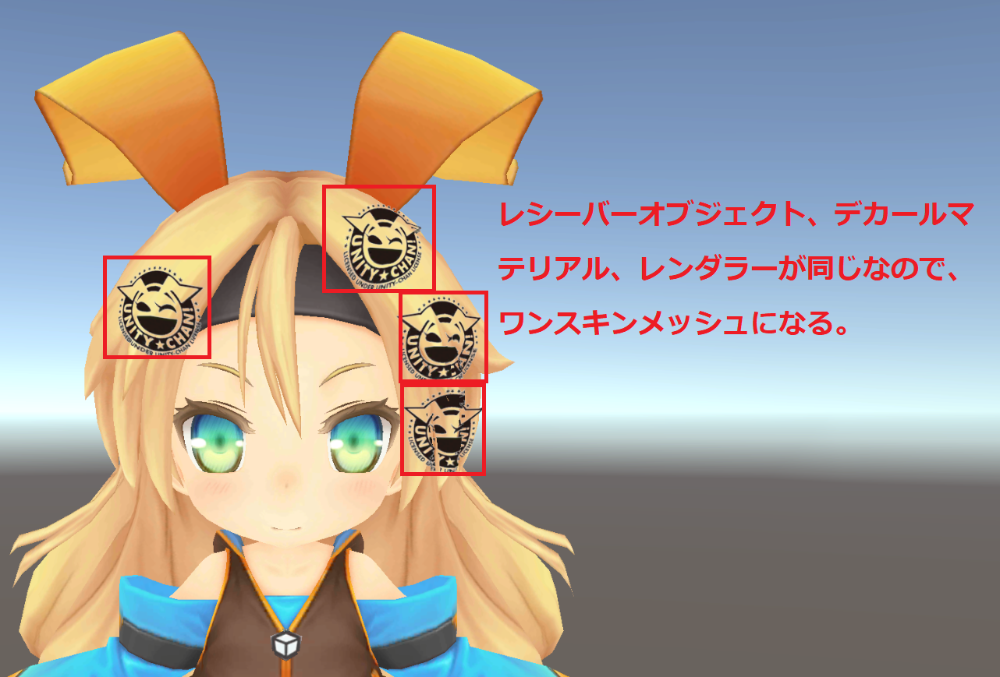
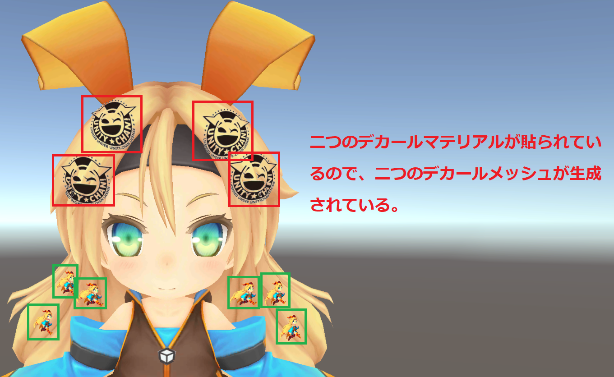
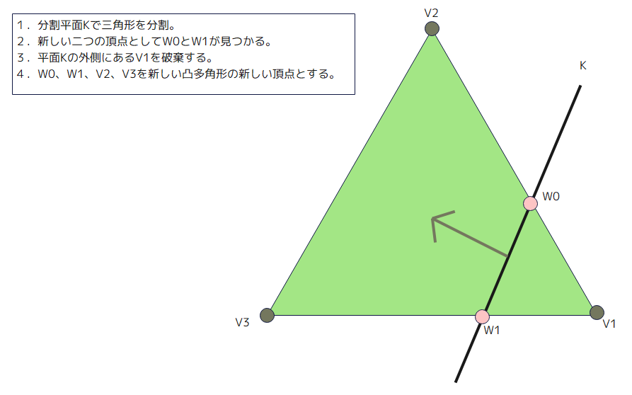

# Air Sticker 技術ドキュメント

## Section 1 概要
このドキュメントはAir Stickerの内部で使われているアルゴリズムなどの詳細を説明する、エンジニア向けのドキュメントです。<br/>

また、エンドユーザー向けのAir Stickerの使用方法に関するドキュメントは下記を参照してください。<br/>

**使用方法** ([日本語](README.md))


## Section 2 アルゴリズム概要
Air Stickerはデカールテクスチャを貼り付けるデカールメッシュを動的に生成して、デカール表現を行っています。<br/>
次の図のように、キャラクターにステッカーをデカールとして貼り付ける場合、そのステッカーがモデルに綺麗に添うようなデカールメッシュを動的に生成します。<br/>

<p align="center">
<br>
<font color="grey">生成されたデカールメッシュ</font>
</p>


デカールメッシュの作成アルゴリズムのステップは次のようになっています。
1. デカールメッシュプールから編集するデカールメッシュを取得
2. デカールテクスチャを貼り付けるレシーバーオブジェクトのレンダラーから三角形ポリゴンスープを取得
3. デカールテクスチャを貼り付ける三角形ポリゴンの早期枝切り(ブロードフェーズ)
4. デカールボックスの情報から分割平面を定義
5. 4で定義した分割平面で衝突する三角形ポリゴンを分割して、多角形ポリゴンにしていく
6. 5で作られた多角形ポリゴン情報を元に、デカールメッシュを生成

また、4～6のポリゴン分割ついては「ゲームプログラミングのための3D数学」の「9.2デカールの貼り付け」を参考にしているため、アルゴリズムの概要と関連ソースコードの記述のみにとどめます。ポリゴン分割の詳細については参考文献を参照して下さい。

## Section 3 アルゴリズム詳細
Section 3では各種ステップの詳細を説明してきます。
### 3.1 デカールメッシュプールから編集するデカールメッシュを取得
AirStickerSystemが保持しているデカールメッシュプールから編集するデカールメッシュを取得します。<br/>
デカールメッシュはレシーバーオブジェクト、レンダラー、マテリアルのハッシュ値をキーとして、プールに登録されており、この値が同一であれば使いまわしされます。
また、このハッシュ値がプールに登録されていなければ、新しくデカールメッシュを作成します。<br/>
そのため、次のようなデカールの場合は一つのデカールメッシュとして扱われています。

<p align="center">
<br>
<font color="grey">一つのデカールメッシュ</font>
</p>
また、次のようなケースであれば、レシーバーオブジェクト、レンダラーは同じですが、デカールマテリアルが異なるため、二つのデカールメッシュとして扱われています。

<p align="center">
<br>
<font color="grey">二つのデカールメッシュ</font>
</p>


デカールメッシュの数＝ドローコールの数です。そのため、デカールメッシュの種類を減らすことが最適化の一つの指針になります。

[**プールからデカールメッシュを取得しているコード**]
```C#
// レシーバー オブジェクトのレンダラーのみを収集したいのだが、
// デカールメッシュのレンダラーがレシーバーオブジェクトにぶら下がっている。
// そのため、一時的にデカールメッシュのレンダラーを無効にします。
Instance._decalMeshPool.DisableDecalMeshRenderers();
var renderers = receiverObject.GetComponentsInChildren<Renderer>();
foreach (var renderer in renderers)
{
    if (!renderer) return;
    var pool = Instance._decalMeshPool;
    var hash = DecalMeshPool.CalculateHash(receiverObject, renderer, decalMaterial);
    if (pool.Contains(hash))
    {
        results.Add(pool.GetDecalMesh(hash));
    }
    else
    {
        var newMesh = new DecalMesh(receiverObject, decalMaterial, renderer);
        results.Add(newMesh);
        pool.RegisterDecalMesh(hash, newMesh);
    }
}

// 無効にしたデカールメッシュレンダラーを元に戻す。
Instance._decalMeshPool.EnableDecalMeshRenderers();
```

**関連ソースコード**<br/>
[Assets/AirSticker/Runtime/Scripts/Core/DecalMeshPool.cs](Assets/AirSticker/Runtime/Scripts/Core/DecalMeshPool.cs)<br/>
[Assets/AirSticker/Runtime/Scripts/Core/DecalMesh.cs](Assets/AirSticker/Runtime/Scripts/Core/DecalMesh.cs)

### 3.2 デカールを貼り付けるレシーバーオブジェクトの三角形ポリゴンスープを取得
AirStickerSystemが保持している三角形ポリゴンスープのプールからレシーバオブジェクトの三角形ポリゴンスープを取得します。<br/>
このプールはレシーバーオブジェクトをキーとして、三角形ポリゴンスープが登録されており、すでに登録済みの場合は、使いまわしされます。また、新規のレシーバーオブジェクトであれば、レンダラーの情報から三角形ポリゴンスープが作成されます。<br/><br/>

[**メッシュフィルターから三角形ポリゴン情報を収集しているコード**]
```C#
private IEnumerator BuildFromMeshFilter(MeshFilter[] meshFilters, MeshRenderer[] meshRenderers,
    List<ConvexPolygonInfo> convexPolygonInfos)
{
        ・
        ・
        ・
    foreach (var meshFilter in meshFilters)
    {
        if (!meshFilter || meshFilter.sharedMesh == null)
            // メッシュフィルターが削除されているので中断。
            yield break;
        var mesh = meshFilter.sharedMesh;
        using var meshDataArray = Mesh.AcquireReadOnlyMeshData(mesh);
        var meshData = meshDataArray[0];
        meshData.GetVertices(_workingVertexPositions);
        meshData.GetNormals(_workingVertexNormals);
        var subMeshCount = meshData.subMeshCount;
        for (var meshNo = 0; meshNo < subMeshCount; meshNo++)
        {
            meshData.GetIndices(_workingTriangles, meshNo);
            var numPoly = polygonCounts[indexOfPolygonCounts++];
            for (var i = 0; i < numPoly; i++)
            {
                if ((newConvexPolygonNo + 1) % MaxGeneratedPolygonPerFrame == 0)
                    // １フレームに処理できるポリゴン数はMaxGeneratedPolygonPerFrameに設定されている数まで。
                    yield return null;
                if (!meshFilter || meshFilter.sharedMesh == null)
                    // メッシュフィルターが削除されているので中断。
                    yield break;
                // 三角形データを収集する。

                     ・
                     ・
                     ・
                // 収集したデータから新しいポリゴン情報を作成する。
                newConvexPolygonInfos[newConvexPolygonNo] = new ConvexPolygonInfo
                {
                    ConvexPolygon = new ConvexPolygon(
                        positionBuffer,
                        normalBuffer,
                        boneWeightBuffer,
                        lineBuffer,
                        localPositionBuffer,
                        localNormalBuffer,
                        meshRenderers[rendererNo],
                        startOffsetOfBuffer,
                        VertexCountOfTrianglePolygon,
                        rendererNo,
                        VertexCountOfTrianglePolygon)
                };
                newConvexPolygonNo++;
                startOffsetOfBuffer += VertexCountOfTrianglePolygon;
            }
        }

        rendererNo++;
    }

    convexPolygonInfos.AddRange(newConvexPolygonInfos);
}
```
**関連ソースコード**<br/>
[Assets/AirSticker/Runtime/Scripts/Core/ReceiverObjectTrianglePolygonsPool.cs](Assets/AirSticker/Runtime/Scripts/Core/ReceiverObjectTrianglePolygonsPool.cs)<br/>
[Assets/AirSticker/Runtime/Scripts/Core/TrianglePolygonsFactory.cs](Assets/AirSticker/Runtime/Scripts/Core/TrianglePolygonsFactory.cs)
<br/>
[Assets/AirSticker/Runtime/Scripts/Core/ConvexPolygon.cs](Assets/AirSticker/Runtime/Scripts/Core/ConvexPolygon.cs)

### 3.3 デカールを貼り付ける三角形ポリゴンの早期枝切り(ブロードフェーズ)
このステップでは、デカールボックスの起点となる座標と各ポリゴンの頂点との距離の計算により、このステップ以降に処理する三角形ポリゴンを早期枝切りするためのブロードフェーズが実行されます。<br/>
ブロードフェーズによる安価な計算による早期枝切りが行われることによって、後のステップの複雑な処理の計算量を下げることができるため、大幅な高速化が期待できます。

また、デカールボックスとは、デカールを貼り付ける空間を現わすボックスです。<br/>
<p align="center">
<br>
<font color="grey">デカールボックス</font>
</p>

[**早期枝切を行っているコード**]
```C#
// 三角形ポリゴン情報でのループ
foreach (var convexPolygonInfo in convexPolygonInfos)
{
    if (Vector3.Dot(decalSpaceNormalWs, convexPolygonInfo.ConvexPolygon.FaceNormal) < 0)
    {
        // デカールボックスの向きと真逆を向いているポリゴン。
        // 枝切りの印をつける。
        convexPolygonInfo.IsOutsideClipSpace = true;
        continue;
    }

    var v0 = convexPolygonInfo.ConvexPolygon.GetVertexPosition(0);
    v0 -= originPosInDecalSpace;
    if (v0.sqrMagnitude > threshold)
    {
        var v1 = convexPolygonInfo.ConvexPolygon.GetVertexPosition(1);
        v1 -= originPosInDecalSpace;
        if (v1.sqrMagnitude > threshold)
        {
            var v2 = convexPolygonInfo.ConvexPolygon.GetVertexPosition(2);
            v2 -= originPosInDecalSpace;
            if (v2.sqrMagnitude > threshold)
                // 全ての頂点が範囲外。
                convexPolygonInfo.IsOutsideClipSpace = true;
        }
    }
}
```
### 3.4 デカールボックスの情報から分割平面を定義
続いて、衝突点の情報とデカールボックスの幅、高さなどの情報を元に、デカールボックスを構築する6平面の情報を構築します。分割平面の定義の詳細は「ゲームプログラミングのための3D数学」の「9.2.1 デカールメッシュの構築」を参照してください。

[**分割平面を定義しているコード**]
```C#
private void BuildClipPlanes(Vector3 basePoint)
{
    var trans = transform;
    var decalSpaceTangentWS = _decalSpace.Ex;
    var decalSpaceBiNormalWS = _decalSpace.Ey;
    var decalSpaceNormalWS = _decalSpace.Ez;
    // Build left plane.
    _clipPlanes[(int)ClipPlane.Left] = new Vector4
    {
        x = decalSpaceTangentWS.x,
        y = decalSpaceTangentWS.y,
        z = decalSpaceTangentWS.z,
        w = width / 2.0f - Vector3.Dot(decalSpaceTangentWS, basePoint)
    };
        ・
        ・
       省略
        ・
        ・
    // Build back plane.
    _clipPlanes[(int)ClipPlane.Back] = new Vector4
    {
        x = decalSpaceNormalWS.x,
        y = decalSpaceNormalWS.y,
        z = decalSpaceNormalWS.z,
        w = _basePointToFarClipDistance - Vector3.Dot(decalSpaceNormalWS, basePoint)
    };
}
```
**関連ソースコード**<br/>
[Assets/AirSticker/Runtime/Scripts/AirStickerProjector.cs](Assets/AirSticker/Runtime/Scripts/AirStickerProjector.cs)

### 3.5 4で定義した分割平面で衝突する三角形ポリゴンを分割して、多角形ポリゴンにしていく
ここでは、三角形ポリゴンの各辺と６枚の分割平面との交差を判定を行って分割していき、凸多角形ポリゴンにしていきます。三角形ポリゴンの分割の詳細は「ゲームプログラミングのための3D数学」の「9.2.2 ポリゴンのクリッピング」を参照してください。
<p align="center">
<br>
<font color="grey">凸多角形ポリゴンを三角形ポリゴンとして扱う</font>
</p>

**関連ソースコード**<br/>
[Assets/AirSticker/Runtime/Scripts/AirStickerProjector.cs](Assets/AirSticker/Runtime/Scripts/AirStickerProjector.cs)

### 3.7 6で作られた多角形ポリゴン情報を元に、デカールメッシュを生成
三角形ポリゴンの分割で得られた、凸多角形ポリゴンの頂点情報を元に、三角形ポリゴンを生成していき、最終的なデカールメッシュを生成します。凸多角形ポリゴンはトライアングルファンの三角形の集合と扱うことができるため、この特性を利用して、デカールメッシュに新たな三角形を追加していきます。凸多角形ポリゴンから三角形ポリゴンの構築の詳細は「ゲームプログラミングのための3D数学」の「9.2.2 ポリゴンのクリッピング」を参照してください。
<p align="center">
<br>
<font color="grey">凸多角形ポリゴンを三角形ポリゴンとして扱う</font>
</p>

**関連ソースコード**<br/>
[Assets/AirSticker/Runtime/Scripts/Core/AirStickerMesh.cs](Assets/AirSticker/Runtime/Scripts/Core/AirStickerMesh.cs)

